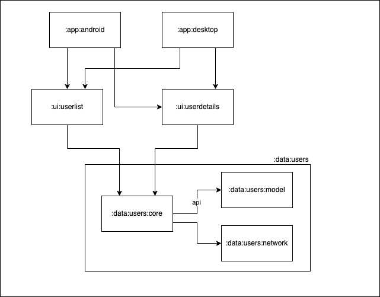
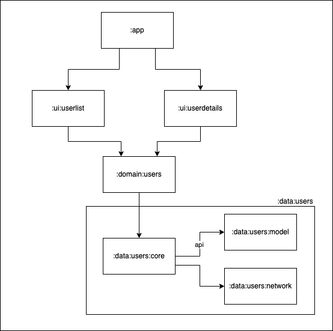

# DemoListApp

Hi jobandtalent! 👋🏽  
This is my take on your technical challenge. I tried to make small changes in each commit, so I would suggest going through it commit by commit.

In this app I focused on architecture, modularization and tests. I did compromise on the UI (it is very basic) and error handling (there is no error handling). Although such a small application does not need so many modules, I tried to apply patterns I would use in much bigger applications.

## Used technologies
- Dependency injection / **Service locator**:  
I used [Koin](https://insert-koin.io/) + [cokoin](https://github.com/burnoo/cokoin) for Dependency Injection. I chose it over Dagger as I have recent experience using it. It's also easier to set up, which is important when you work under time pressure. I also wanted to try my own library (cokoin) in a project. Koin is not as efficient and powerful as Dagger, but it is working fine enough (Koin is also technically Service Locator rather than Dependency Injection tool).
- UI Framework: [Jetpack Compose](https://developer.android.com/jetpack/compose)
- Asynchronous programming: Kotlin [Flow](https://kotlinlang.org/docs/flow.html)/[Coroutines](https://kotlinlang.org/docs/coroutines-overview.html)
- Unit Tests: [Kotlin test](https://kotlinlang.org/api/latest/kotlin.test/) + [Kotest assertions](https://kotest.io/docs/assertions/assertions.html)
- UI Tests: [Compose Testing](https://developer.android.com/jetpack/compose/testing)
- JSON Serialization: [Kotlin Serialization](https://kotlinlang.org/docs/serialization.html)
- Network: [Ktor](https://ktor.io/docs/getting-started-ktor-client.html)
- Navigation: [Compose Navigation](https://developer.android.com/jetpack/compose/navigation)
- Style: [Compose Material 3](https://developer.android.com/jetpack/androidx/releases/compose-material3) (hardly used)
- Image loading: [coil](https://coil-kt.github.io/coil/)
- Dependency management in project: [Gradle Version Catalog](https://docs.gradle.org/current/userguide/platforms.html#sub:version-catalog)
- Dependency management bot: [Renovate Bot](https://www.whitesourcesoftware.com/free-developer-tools/renovate/)
- CI: [Github Actions](https://github.com/features/actions)
- Static code analyser/formater - [ktlint](https://pinterest.github.io/ktlint/) (used locally with git hooks)

## Architecture and modules
In app there are two layers - Data and UI (+ optional Domain layer on [`domain` branch](https://github.com/burnoo/DemoListApp/tree/domain)). Modules are split by layer and by feature. This approach is inspired by [talk from recent Android Dev Summit](https://www.youtube.com/watch?v=16SwTvzDO0A).

There are two ui modules: `userlist` and `userdetails` (both with MVVM architecture) and single data module: `users`.

Diagram of modules used in the app (core and test modules are omitted):

  
With domain layer

  
  
  

  

### Modules
- `:core`
  - `:core:designsystem` - contains `AppTheme` and common UI elements
  - `:core:utils` - contains simple util functions
  - `:core:compose-utils` - contains Jetpack Compose utils for tests and previews
- `:data`
  - `:data:users:core` - contains repository, includes `:model` via `api()`
  - `:data:users:model` - contains models used in the application
  - `:data:users:network` - contains network data sources with JSON parsing
  - `:data:users:core-test`, `:data:users:network-test` - contains test utils and fake implementations
- `:domain` (on [`domain` branch](https://github.com/burnoo/DemoListApp/tree/domain))
  - `:domain:users` - contains UseCases
- `:ui` - module for all features in app
  - `:ui:userlist` - user list feature
  - `:ui:userdetails` - user details feature
- `:app` - module that connects all features, contains `MainActivity` with root navigation

## Tests
- Unit Tests
  - for ViewModels ([UserDetailsViewModelTest](https://github.com/burnoo/DemoListApp/blob/main/ui/userdetails/src/test/kotlin/dev/burnoo/demo/listapp/ui/userdetails/UserDetailsViewModelTest.kt) and [UserListViewModelTest](https://github.com/burnoo/DemoListApp/blob/main/ui/userlist/src/test/kotlin/dev/burnoo/demo/listapp/userlist/UserListViewModelTest.kt))
  - for utils functions ([TitleParserTest](https://github.com/burnoo/DemoListApp/blob/main/core/utils/src/test/kotlin/dev/burnoo/demo/listapp/core/utils/TitleParserTest.kt))
  - for Api and JSON parsing ([UsersApiTest](https://github.com/burnoo/DemoListApp/blob/main/data/users/network/src/test/kotlin/dev/burnoo/demo/listapp/data/users/network/api/UsersApiTest.kt))
  - for Repository ([UsersRemoteRepositoryTest](https://github.com/burnoo/DemoListApp/blob/main/data/users/core/src/test/kotlin/dev/burnoo/demo/listapp/data/users/core/UsersRemoteRepositoryTest.kt))
  - for UseCases on [`domain` branch](https://github.com/burnoo/DemoListApp/tree/domain) ([GetUsersUseCaseTest](https://github.com/burnoo/DemoListApp/blob/domain/domain/users/src/test/kotlin/dev/burnoo/demo/listapp/domain/users/GetUsersUseCaseTest.kt) and [GetUserUseCaseTest](https://github.com/burnoo/DemoListApp/blob/domain/domain/users/src/test/kotlin/dev/burnoo/demo/listapp/domain/users/GetUserUseCaseTest.kt))
- UI Tests:
  - Screen tests ([UserListContentTest](https://github.com/burnoo/DemoListApp/blob/main/ui/userlist/src/androidTest/kotlin/dev/burnoo/demo/listapp/ui/userdetails/composables/UserListContentTest.kt) and [UserDetailsContentTest](https://github.com/burnoo/DemoListApp/blob/main/ui/userdetails/src/androidTest/kotlin/dev/burnoo/demo/listapp/ui/userdetails/composables/UserDetailsContentTest.kt))
  - E2E test - running whole app with mocked JSON responses ([AppTest](https://github.com/burnoo/DemoListApp/blob/main/app/src/androidTest/kotlin/dev/burnoo/demo/listapp/AppTest.kt))

## Next steps
I didn't implement all features I wanted in the application as I didn't have enough time. This list contains features I would add next:
1. Error handling - catching exceptions, converting it to sealed Error class and wrapping it in Either or Result class.
2. Pagination
3. Support for Landscape layout
4. Screenshot tests
5. Better, custom UI
6. Configure ktlint on CI

## Video
https://user-images.githubusercontent.com/17478192/202911577-2448570c-87d9-4b3e-bae9-1843d173eba4.mp4
