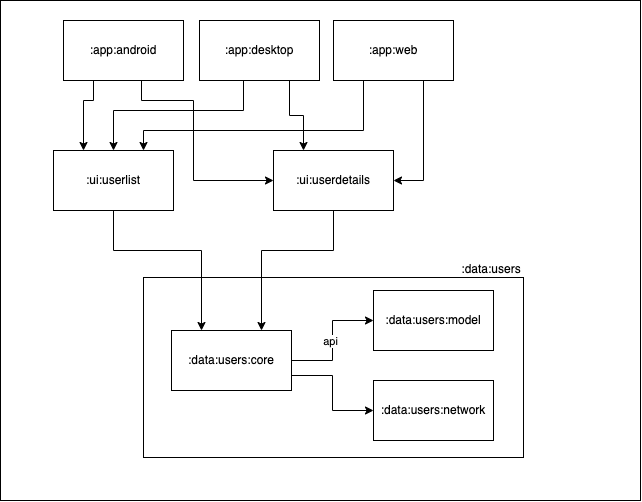

# DemoListApp

Hello World! 👋🏽  
This project is a simple Compose Multiplatform app (Android + Desktop for now) that demonstrates my Android and Kotlin Multiplatform skills. It contains two screens: user list and user details.

In this app I focused on architecture, modularization, tests, and compromised on the UI - it is very basic. Although such a small application does not need so many modules, I tried to apply patterns I would use in much bigger applications.

## Used technologies
- UI Framework: [Compose Multiplatform](https://www.jetbrains.com/lp/compose-mpp/)
- Dependency injection / **Service locator**: [Koin](https://insert-koin.io/) + [cokoin](https://github.com/burnoo/cokoin)
- Asynchronous programming: Kotlin [Flow](https://kotlinlang.org/docs/flow.html)/[Coroutines](https://kotlinlang.org/docs/coroutines-overview.html)
- Unit Tests: [Kotlin test](https://kotlinlang.org/api/latest/kotlin.test/) + [Kotest assertions](https://kotest.io/docs/assertions/assertions.html)
- UI Tests: [Compose Testing](https://developer.android.com/jetpack/compose/testing) (Multiplatform and Android)
- JSON Serialization: [Kotlin Serialization](https://kotlinlang.org/docs/serialization.html)
- Network: [Ktor](https://ktor.io/docs/getting-started-ktor-client.html)
- Style: [Compose Material 3](https://developer.android.com/jetpack/androidx/releases/compose-material3) (hardly used)
- Image loading: [Kamel](https://github.com/alialbaali/Kamel)
- Navigation (for Android): [Compose Navigation](https://developer.android.com/jetpack/compose/navigation)
- Dependency management in project: [Gradle Version Catalog](https://docs.gradle.org/current/userguide/platforms.html#sub:version-catalog)
- Dependency management bot: [Renovate Bot](https://www.whitesourcesoftware.com/free-developer-tools/renovate/)
- CI: [Github Actions](https://github.com/features/actions)
- Static code analyser/formater - [ktlint](https://pinterest.github.io/ktlint/) (used locally with git hooks)

## Architecture and modules
In app there are two layers - Data and UI. Modules are split by layer and by feature. This approach is inspired by [talk from recent Android Dev Summit](https://www.youtube.com/watch?v=16SwTvzDO0A).

There are two ui modules: `userlist` and `userdetails` (both with MVVM architecture) and single data module: `users`.

Diagram of modules used in the app (core and test modules are omitted):

### Modules
- `:core`
  - `:core:designsystem` - contains `AppTheme` and common UI elements
  - `:core:data` - contains core data logic (e.g. Pager class)
  - `:core:ui` - contains core ui logic (e.g. multiplatform `ViewModel`)
  - `:core:utils` - contains simple util functions
  - `:core:compose-utils` - contains Jetpack Compose utils for tests and previews
- `:data`
  - `:data:users:core` - contains repository, includes `:model` via `api()`
  - `:data:users:model` - contains models used in the application
  - `:data:users:network` - contains network data sources with JSON parsing
  - `:data:users:core-test`, `:data:users:network-test` - contains test utils and fake implementations
- `:ui` - module for all features in app
  - `:ui:userlist` - user list feature
  - `:ui:userdetails` - user details feature
- `:app` - module that connects all features, contains platform applications with navigation
  - `:app:android` - Android application
  - `:app:desktop` - Desktop application

## Tests
- Unit Tests
  - for ViewModels ([UserDetailsViewModelTest](https://github.com/burnoo/DemoListApp/blob/main/ui/userdetails/src/jvmTest/kotlin/dev/burnoo/demo/listapp/ui/userdetails/UserDetailsViewModelTest.kt) and [UserListViewModelTest](https://github.com/burnoo/DemoListApp/blob/main/ui/userlist/src/jvmTest/kotlin/dev/burnoo/demo/listapp/ui/userlist/UserListViewModelTest.kt))
  - for utils functions ([TitleParserTest](https://github.com/burnoo/DemoListApp/blob/main/core/utils/src/commonTest/kotlin/dev/burnoo/demo/listapp/core/utils/TitleParserTest.kt))
  - for Api and JSON parsing ([UsersApiTest](https://github.com/burnoo/DemoListApp/blob/main/data/users/network/src/commonTest/kotlin/dev/burnoo/demo/listapp/data/users/network/api/UsersApiTest.kt))
  - for Repository ([UsersRemoteRepositoryTest](https://github.com/burnoo/DemoListApp/blob/main/data/users/core/src/commonTest/kotlin/dev/burnoo/demo/listapp/data/users/core/UsersRemoteRepositoryTest.kt))
  - for core data logic ([PagerTest](https://github.com/burnoo/DemoListApp/blob/main/core/data/src/commonTest/kotlin/dev/burnoo/demo/listapp/core/data/PagerTest.kt))
- UI Tests:
  - [JVM Compose] Screen tests ([UserListContentTest](https://github.com/burnoo/DemoListApp/blob/main/ui/userlist/src/jvmTest/kotlin/dev/burnoo/demo/listapp/ui/userlist/composables/UserListContentTest.kt) and [UserDetailsContentTest](https://github.com/burnoo/DemoListApp/blob/main/ui/userdetails/src/jvmTest/kotlin/dev/burnoo/demo/listapp/ui/userdetails/composables/UserDetailsContentTest.kt)
  - [JVM Compose] E2E test - running whole app with mocked JSON responses ([DesktopAppTest](https://github.com/burnoo/DemoListApp/blob/main/app/desktop/src/jvmTest/kotlin/dev/burnoo/demo/listapp/DesktopAppTest.kt))
  - [Android Compose] E2E test - running whole app with mocked JSON responses ([AndroidAppTest](https://github.com/burnoo/DemoListApp/blob/main/app/android/src/androidTest/kotlin/dev/burnoo/demo/listapp/AndroidAppTest.kt))

## Next steps
1. Support for Compose JS
2. Support for Landscape layout
3. Screenshot tests
4. Better, custom UI
5. Configure ktlint on CI
6. (maybe) iOS app

## Video
https://user-images.githubusercontent.com/17478192/205705588-75a791fc-3673-4020-b906-1eb44fc25771.mp4

### Special thanks
to @MiSikora and @AlexKrupa for doing a code review. Following commits were added:
https://github.com/burnoo/DemoListApp/commit/b99c348afa2854c348cf9e795f2331ba3e0a09ef, https://github.com/burnoo/DemoListApp/commit/f4a621b6d8680bc2836beec3340a08cc7303b16e, https://github.com/burnoo/DemoListApp/commit/794985f8fb96fa14bf6f190c331f30135f392f95, https://github.com/burnoo/DemoListApp/commit/5301f471ece120c5159d4e65de0e2d058636aacd, https://github.com/burnoo/DemoListApp/commit/8a72e19707acfb805a8d9b56f7eb4038a426f60c, https://github.com/burnoo/DemoListApp/commit/424e90544a78462850a832831024957ecc65550b, https://github.com/burnoo/DemoListApp/commit/6b8be276a374dcc6c3c4555b7988ffbaa9df9d9c, https://github.com/burnoo/DemoListApp/commit/a0958a33456490361ea9ccde8bd7a2b01843e56b